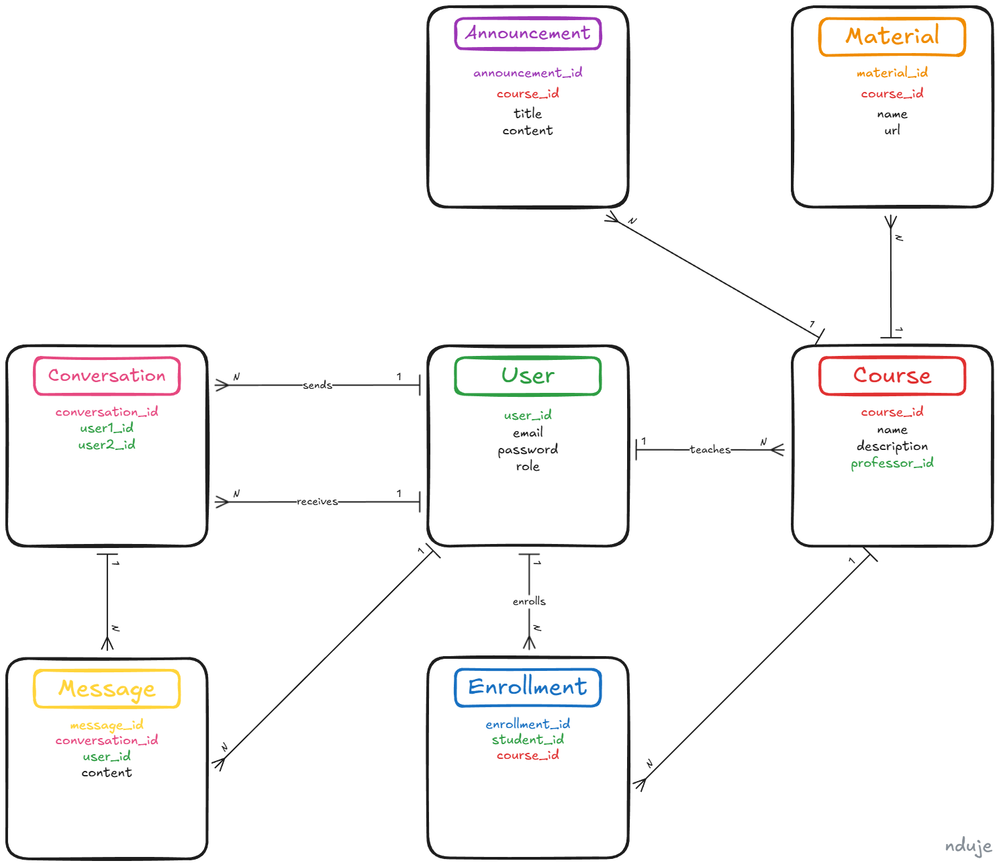

# Moodle Console Application

### DUMP Internship: Week 7 - EF Core

## Task

This project represents a **console-based Moodle system** implemented in **.NET + EF Core** with a **PostgreSQL database**, simulating a simplified learning management system.

The application allows:

- User authentication with roles: **Student, Professor, Admin**
- Management of courses and student enrollments
- Posting course **announcements** and **materials**
- Private chat between users
- Admin-only user management (create, edit, delete, change roles)
- Proper role-based dashboards and menus

## ERD

The project contains an **ERD diagram** that visually displays all database entities, their attributes, and the relationships between them.  


**Key entities**: User, Course, Enrollment, Announcement, Material, Conversation, Message

## Setup

1. Set `Moodle.Console` as the startup project.
2. Create a PostgreSQL database named `Moodle`.
3. Apply migrations to create the database schema and seed data by running the following command in PowerShell from the `/src` folder:

```powershell
dotnet ef database update --project Moodle.Infrastructure --startup-project Moodle.Console
```
